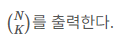

# 이항 계수 1 (11050번)

## 문제


## 입력


## 출력



## 풀이

```python
def factorial(n):
    result = 1
    for i in range(1, n + 1):
        result *= i
    return result

def ihanggyesu(n, k):
    return factorial(n) // (factorial(k) * factorial(n - k))

n, k = map(int, input().split())

print(ihanggyesu(n, k))

```

이건 그냥 수학이라 잘 몰라서 보고서 "아 그렇구나" 했습니다
